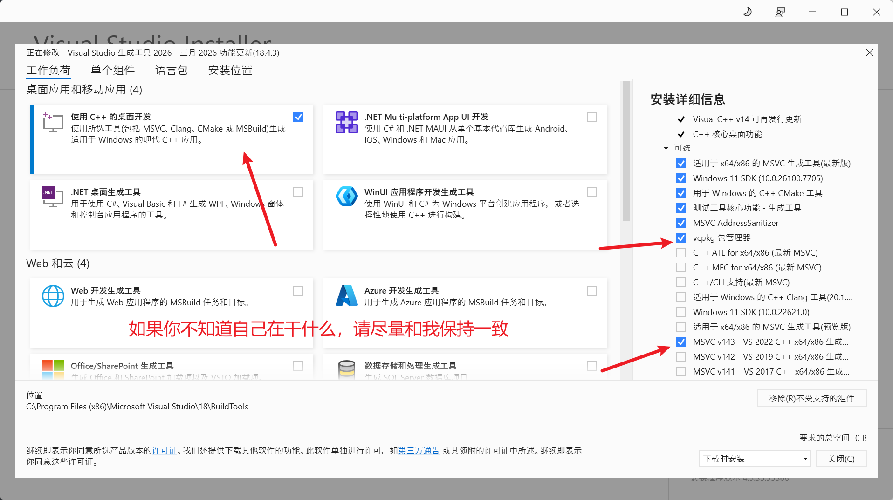
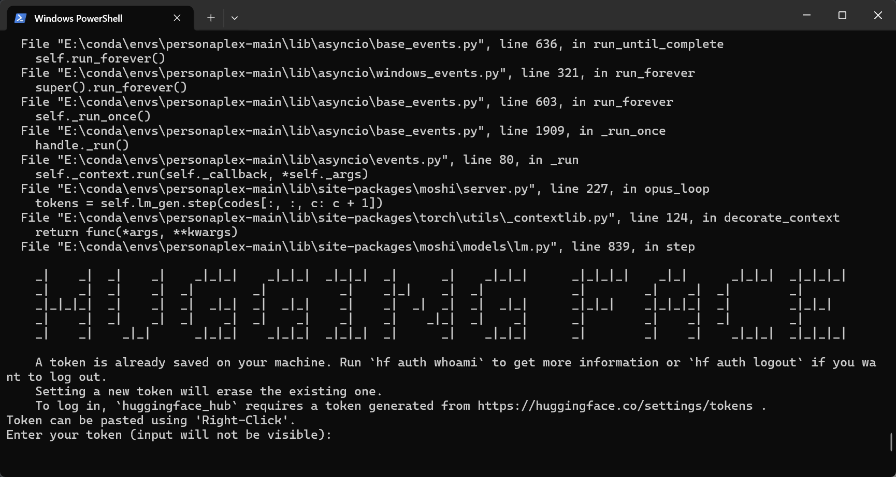
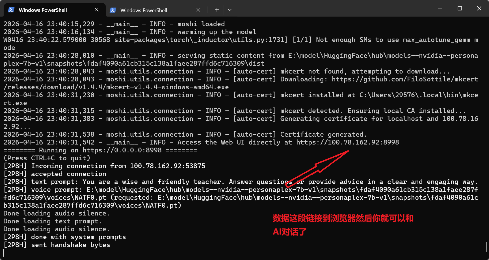
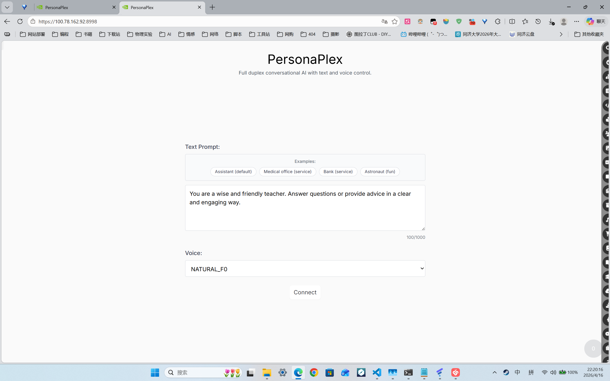
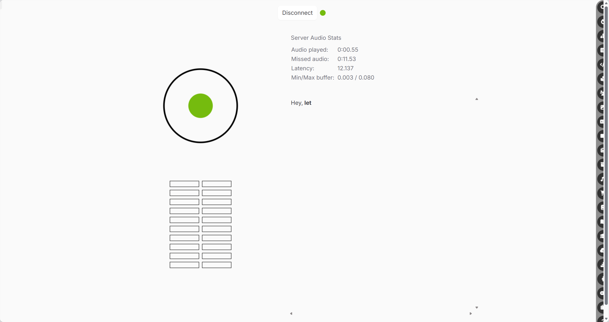
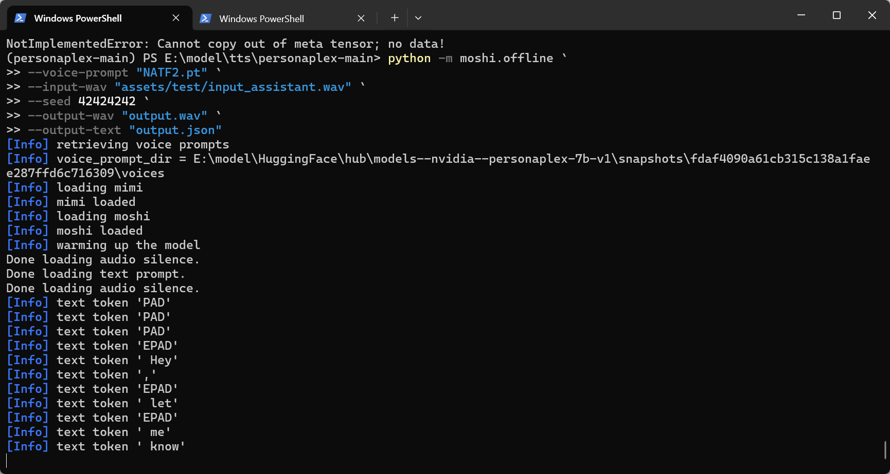
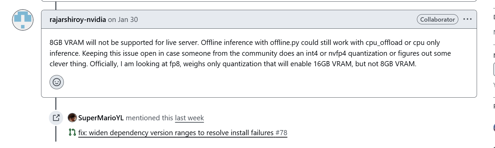

# NVIDIA的Personaplex本地部署实战，小白向
## [什么是Personaplex?](https://github.com/NVIDIA/personaplex)
PersonaPlex 是一种实时、全双工语音转语音对话模型，通过文本角色提示和音频语音条件控制实现角色控制
如果你想本地练习英语口语或者是想在本地跑一个tts模型，那么你来对的地方了！
* 特色：以较少的参数实现了较流利、真实的对话，甚至还可以插话。这为我们在本地部署提供了可能

## **前提条件**
* 硬件条件：
至少32G的内存
N卡
至少16G的显存(这点十分非常重要，我是RTX5060 8G的显卡，后面就遭殃了)
50G左右的磁盘空间
* 软件条件：
科学上网的网络环境
拥有github账号
拥有hugging face的账号
Python
conda
git
[安装最新的显卡驱动](https://www.nvidia.cn/geforce/drivers/)。可以使用```nvidia-smi```查看驱动是否更新好以及支持的CUDA版本
[CUDA工具包](https://developer.nvidia.com/cuda-downloads)，CUDA工具包记得一定要下载对应的版本哦
别忘了重启电脑
* 注：
  - 本文不会再强调以上前提条件，有不懂的请自行咨询AI或者使用搜索引擎查询，csdn bilibili和知乎等
  - 请学会查询官方文档和对应项目readme以及issue的良好习惯，这也是我在跑这个项目时最大的感悟
  - 安装时请验证安装是否成功。比如发送```help``` ```version```等指令
***
如果对AI领域感兴趣的同学相信都会知道。AI领域Linux系统占有主导地位。但是，Linux的纯命令行界面劝退了不少小白。
这里有两条路可以走，第一是在Windows 11上运行WSL2的虚拟环境；另一条就是直接在Windows 11上运行本地模型。不过这会遇到**依赖地狱**，但是管他呢，我就要图形界面!所以本文着重介绍后者，对前者有兴趣的同学也可以留言。

你也可以访问[官方的项目页面](https://github.com/NVIDIA/personaplex)来一步步动手操作，说不定你有别的解决方案
那么打开power shell让我们开始吧!
```
#我们利用conda创造一个叫做learn_ai的虚拟环境Python版本为3.10
#在这里提醒一些同学们Python 3.10是较为稳定的版本，如果选择较高的版本的话，有些包会不支持并且不稳定
conda create -n learn_ai python=3.10
#进入环境
conda activate learn_ai
```

Personaplex需要opus，你可以上[官网](https://opus-codec.org/downloads/)直接下载添加到环境变量，但是我想在这里介绍一个包管理工具 **vcpkg**
因为它开源并且和vscode高度适配，所以我也推荐同学们使用它
vcpkg是C++的一个包管理工具，所以下载它之前，我们需要先配置一下C++的环境
[vs下载官网](https://visualstudio.microsoft.com/zh-hans/downloads/)
所有文件，我推荐下载到D盘一个你找得到位置的地方,因为后续我们要添加到环境变量。善用``cd``

```
git clone https://github.com/microsoft/vcpkg
cd vcpkg
.\bootstrap-vcpkg.bat
```
记得添加环境变量到系统 PATH和重启电脑
```
#终于可以下载了
vcpkg install opus
```

接下来就可以下载Personaplex的依赖了
```
git clone https://github.com/NVIDIA/personaplex.git
cd personaplex-main
#请确保已经进入了下载的文件夹，否则下一步的包编译无法进行
pip install moshi/.
```

**如果使用的是50系的显卡，因为是基于Blackwell的架构，所以我们需要下载更高版本的pytorch**
```
#最后这个CU130的意思是说选择pytorch对应的CUDA的版本(这里推荐的是1.30版本)
#详情参考前面nvidia-smi所支持的版本
pip install torch torchvision torchaudio --index-url https://download.pytorch.org/whl/cu130
```
这个模型还需要Triton，但是这个是在Linux上支持的，不支持win11。咋个办？
>Triton 是一个开源的 高性能 GPU 编程语言和编译器框架

一个方法就是之前说到的WSL2
还有一个就是我们国人大神的Windows移植
伟大，无需多言！
[GitHub地址](https://github.com/woct0rdho/triton-windows)
如果你是个爱折腾的同学的话，会发现现：诶这个仓库已经停止了维护；并且新的维护仓库在3.10版本后也没有直接编译好的包，咋个办?
>Attention is all you need！

在官方的阅读文档中不仅详细提供了哪一系列的显卡的下载哪一个版本的Triton。还有一个外站的[下载仓库](https://pypi.org/project/triton-windows/)
下载到对应的文件夹里边
```
#不要忘了文件后缀， CP310的意思是Python 3.10，前面的3.60说的是Triton的版本
pip install triton_windows-3.6.0.post26-cp310-cp310-win_amd64.whl
```
现在需要你去[hugging face](https://huggingface.co/)上生成一个密钥来获取NVIDIA的模型申请，记得给write权限和保存好密钥，千万不要泄露给他人
```
pip install -U huggingface_hub
hf auth login
#现在输入你的密钥吧。是看不见的哦，不要怀疑有问题
```

```
#生成一个临时的SSL密钥
$SSL_DIR = "$env:TEMP\moshi_ssl"
#如果这不显示成功说明，你已经创建了密钥
New-Item -ItemType Directory -Path $SSL_DIR -Force
#开始运行模型啦!!!不过第一次的话可能要大约下载16G左右的模型
#--cpu-offload这个的意思是说使用CPU进行卸载，显卡不太好的同学可以使用
python -m moshi.server --ssl "$SSL_DIR" --cpu-offload
```



离线本地运行的话也是可以哦
```
python -m moshi.offline \
  --voice-prompt "NATF2.pt" \
  --input-wav "assets/test/input_assistant.wav" \
  --seed 42424242 \
  --output-wav "output.wav" \
  --output-text "output.json"
```

大约等待七八分钟左右会在Personaplex模型的文件夹下边生成一个output.wav文件

后记：
为什么我当时说8GB显存不合适呢？因为官方人员他们技术上就不支持

>8GB显存将无法支持实时服务器运行。通过offline.py进行离线推理仍可通过cpu_offload或纯CPU推理实现。保留此议题开放状态，以便社区成员尝试int4或nvfp4量化方案，或探索其他创新方法。官方目前正在研究仅对权重进行fp8量化的方案，该方案将支持16GB显存配置，但无法适配8GB显存。
